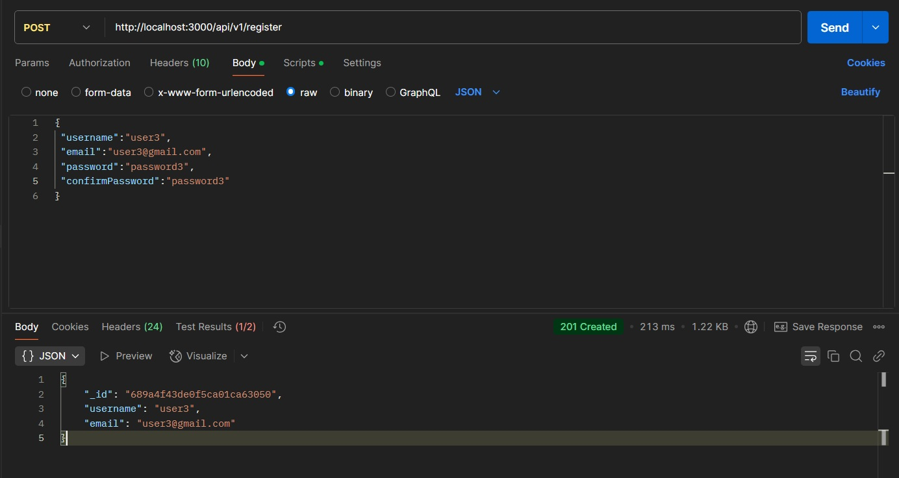
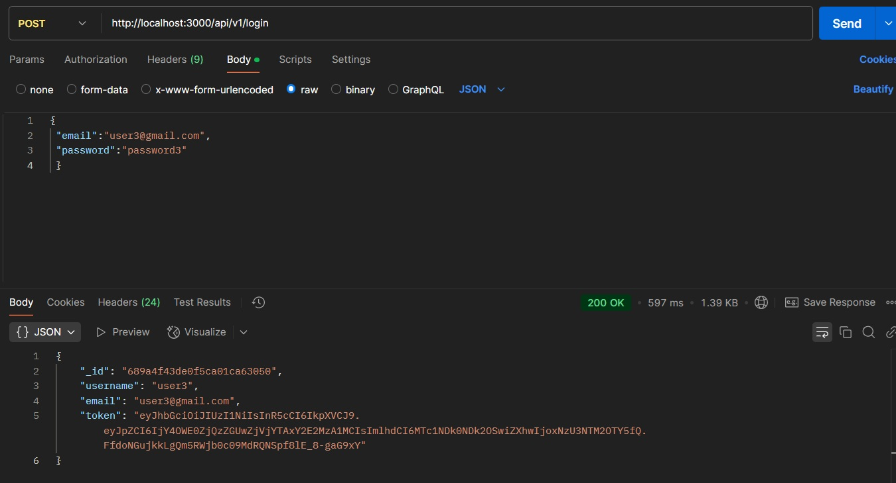
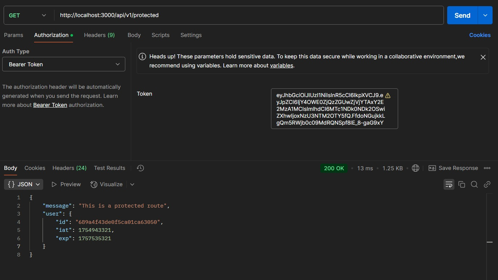

# JWT Authentication and Authorization

We have used JWT when we made our secure API endpoints and MongoDB database. We have made one route for registering a user, another one to log in (here we generated a JWT token) and lastly a protected route where only loged in users can enter it (using a valid JWT). We used Postman API platform for testing the endpoints and displaying app information and errors. We also implemented some security features regarding common attacks such as DoS(denial of service), brute force attacks and NoSQL query injections.

---

## Run locally

Clone the project

- git clone https://github.com/janbezovsek/Node.js-Express.js-with-JWT

Go to the project directory and install required npm packages (package.json file)

Start the server (localhost:3000)

- open new terminal
- npm run start (dev)

We have to create an account for MongoDB database and setup our cluster. Then we aquire the connection string used for connecting the app to the database and save it in our .env file.

---

## .env file

We have to change the DB_URL variable to match whatever value we have in our database configuration. NODE_ENV variable can be either development or production, the difference beeing the error response messages that we see as users.

#This can be either "development" or "production"

NODE_ENV = production

PORT = 3000

DB_URL = mongodb+srv://plenty:@cluster0.z3yuu.mongodb.net/?retryWrites=true&w=majority

#JWT related

JWT_SECRET = your_secret

### Postman

---

---

